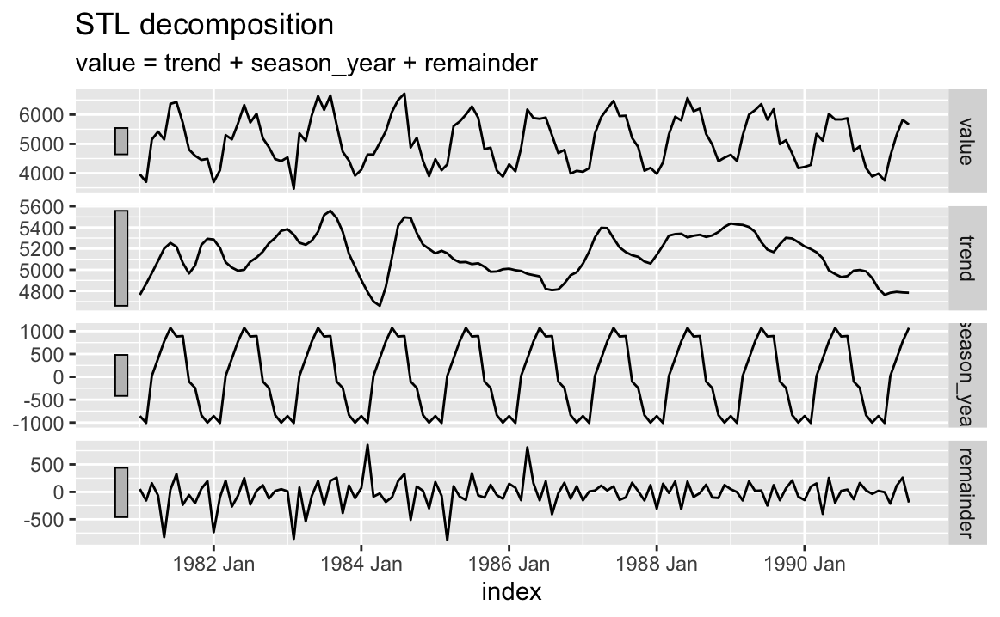
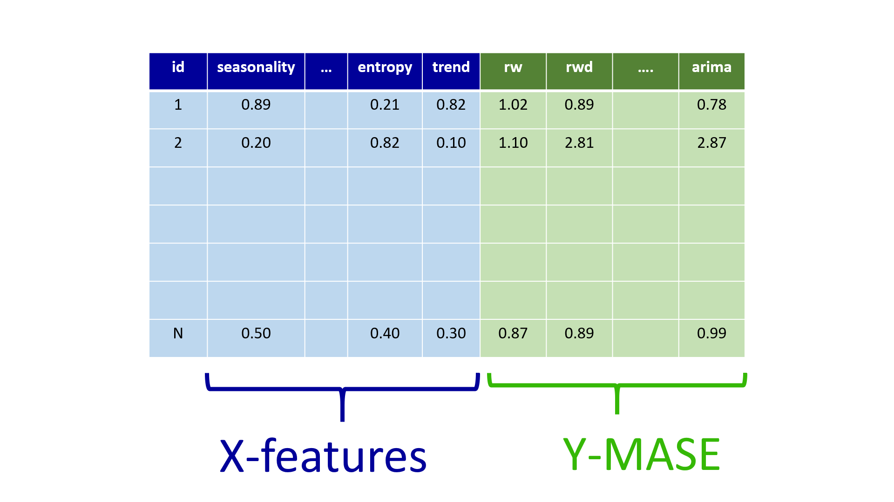
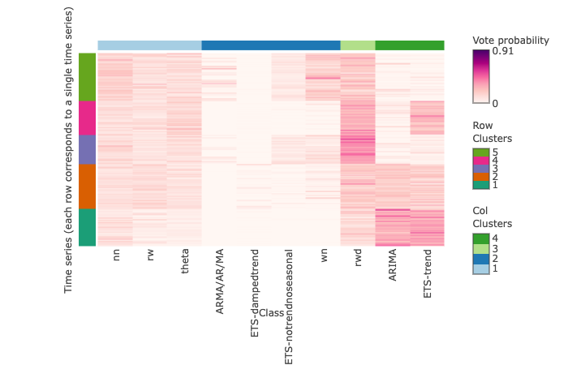
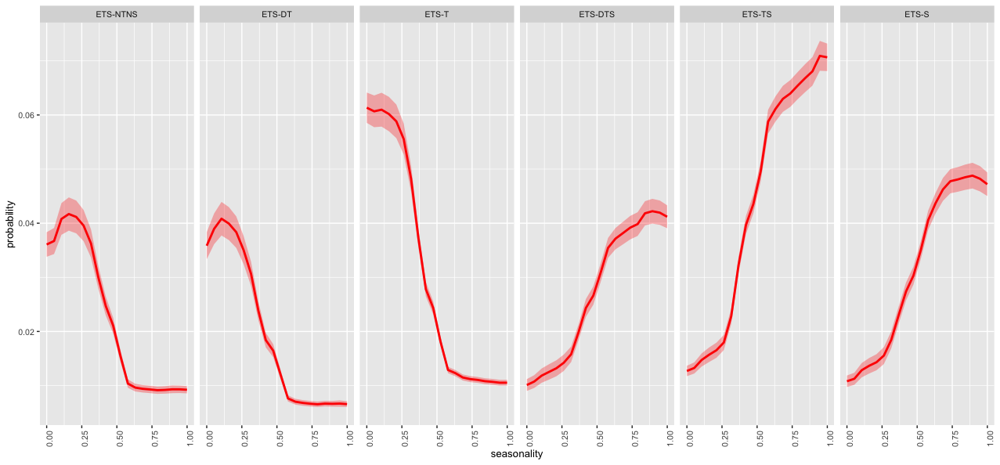
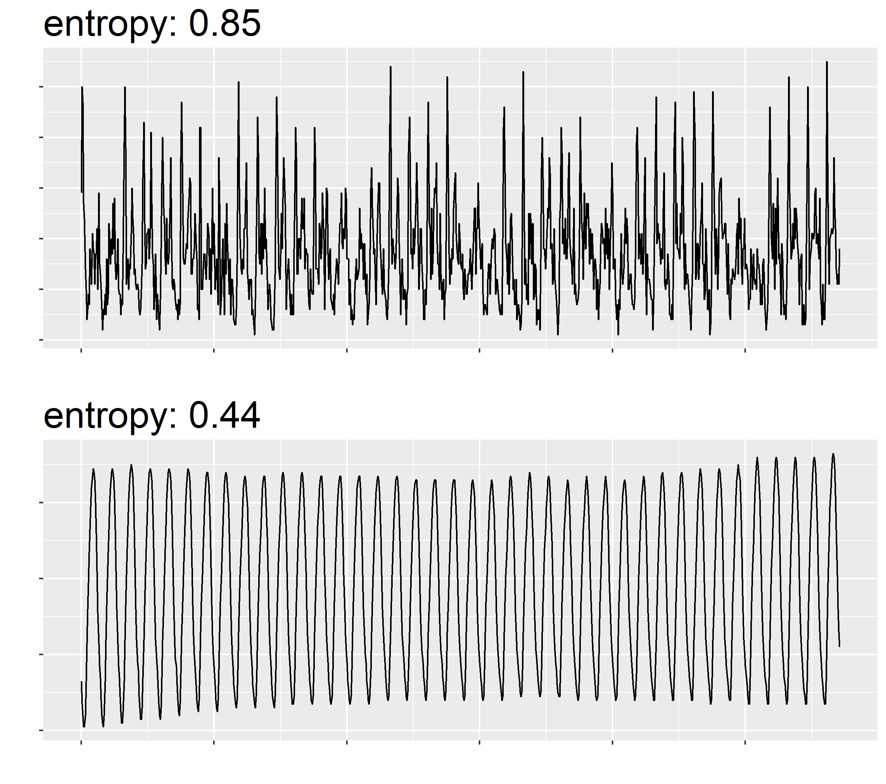
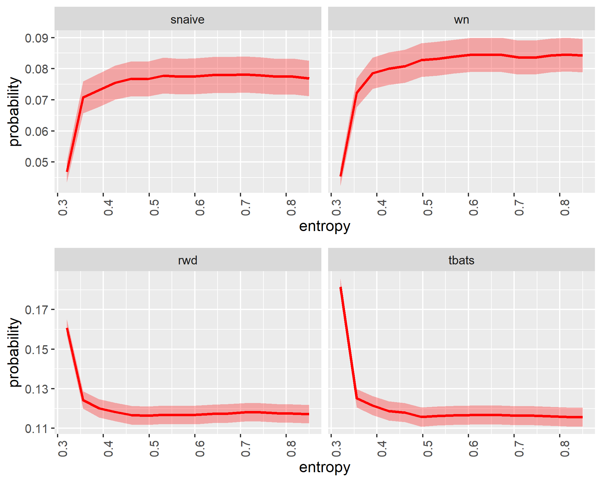
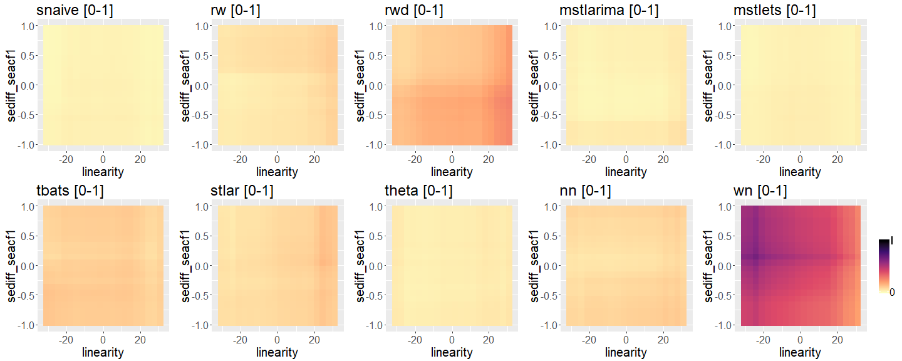
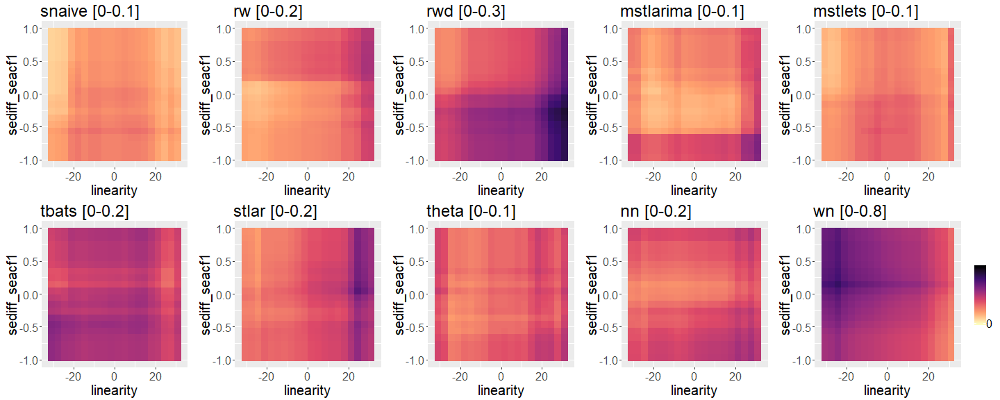

```{r xaringan-themer, include=FALSE, warning=FALSE}
library(xaringanthemer)
style_duo_accent(
  primary_color = "#081d58",
  secondary_color = "#FF961C",
 inverse_header_color = "#FFFFFF",
 title_slide_text_color = "#edf8b1",
 link_color =  "#41b6c4"
)
#style_solarized_light(text_font_google   = google_font("Josefin Sans", "400", "400i", "800i", "800"))
#style_mono_light(
#  base_color = "#1c5253",
#  header_font_google = google_font("Josefin Sans"),
#  text_font_google   = google_font("Josefin Sans", "400", "400i", "800i", "800"),
#  code_font_google   = google_font("Fira Mono")
#)
```

```{r setup, include=FALSE}
options(htmltools.dir.version = FALSE)
library(knitr)
options(htmltools.dir.version = FALSE)
read_chunk("src/main.R")
library(ggplot2)
library(patchwork)
library(reshape2)
library(grid)
library(gridExtra)
library(ggrepel)
library(png)
library(tsfeatures)
library(tidyverse)
library(ggpubr)
library(RColorBrewer)
library(dplyr)
library(forecast)
library(tidyr)
library(rlang)
library(tidyverse)
library(tsfeatures)
library(fable)
library(Mcomp)
```


<style>

.center2 {
  margin: 0;
  position: absolute;
  top: 50%;
  left: 50%;
  -ms-transform: translate(-50%, -50%);
  transform: translate(-50%, -50%);
}

</style>

<style type="text/css">
.remark-slide-content {
    font-size: 30px;
}
</style>

---

background-image: url(python/acknowledgement.png)
background-size: contain

---


### Content


- Time series features


- Feature-based time series forecasting

- Introduction to the tsfeatures package

- Introduction to the seer package

- feasts: **F**eature **E**xtraction **A**nd **S**tatistics for **T**ime **S**eries package in R
    
- What did we learn?

- Where to go from here?


---
class: center, middle

background-image: url(imgwhyr/shopping.jpg)
background-size: contain
class: center, top, inverse

---
background-image: url(imgwhyr/bananas.jpg)
class: center, top, inverse

---

## Sales data

.pull-left[

Data from June, 2012 to November, 2022

```{r, comment=NA, echo=FALSE, message=FALSE, warning=FALSE, size="tiny"}
library(Mcomp)
library(tsibble)
library(lubridate)
library(tidyverse)
set.seed(1)
bananas <- M3$N2012$x
mth <- make_date("2012") + months(5:130)
mth2 <- make_date("2022") + months(11)
bananas <- tibble(
  Time = yearmonth(mth), 
  Sales = bananas)
bananas <- as_tsibble(bananas)
bananas
```


]

.pull-right[

```{r, echo=FALSE, message=FALSE, warning=FALSE, comment=NA}
library(fable)
bananas %>% 
  autoplot(Sales) 
```

]


---


## Sales data

.pull-left[

Data from June, 2012 to November, 2022

```{r, comment=NA, echo=FALSE, message=FALSE, warning=FALSE, size="tiny"}
library(Mcomp)
library(tsibble)
library(lubridate)
library(tidyverse)
set.seed(1)
bananas <- M3$N2012$x
mth <- make_date("2012") + months(5:130)
mth2 <- make_date("2022") + months(11)
bananas <- tibble(
  Time = yearmonth(mth), 
  Sales = bananas)
bananas <- as_tsibble(bananas)
bananas
```


]

.pull-right[

```{r, echo=FALSE, message=FALSE, warning=FALSE, comment=NA}
library(fable)
bananas %>% 
  autoplot(Sales) + geom_vline(xintercept = mth2, lwd=2, col="#e7298a")
```

]


---

## Sales data

.pull-left[

```{r, echo=FALSE, message=FALSE, warning=FALSE, comment=NA}
library(fable)
bananas %>% 
  autoplot(Sales) + geom_vline(xintercept = mth2, lwd=2, col="#e7298a")
```

]

--
.pull-right[

- **How much** will you sell over the next 12 months?

- **How much** do we need to produce and **when**?


]


---


### What might happen during a typical model building process?

```{r, comment=NA, echo=FALSE, fig.width=15}
library(ggplot2)
df <- data.frame(v1=factor(c("Data wrangling", 
  "Data Visualization", 
                                "Data Visualization", 
                                "Data Preprocessing",
                                "Data Visualization", 
  "Model fitting","Evaluating forecast accuracy", "Tunning", "Model fitting", "Evaluating forecast accuracy", "Tunning", "Model fitting", "Evaluating forecast accuracy", "Tunning", "Model fitting","Evaluating forecast accuracy", "Tunning", "Model fitting", "Evaluating forecast accuracy", "Tunning",  "Evaluation", "Data Visualization", "Communication"
    
                                
                                ), levels=c("Data wrangling",
                                            "Data Visualization", "Data Preprocessing", "Model fitting", "Tunning", "Evaluating forecast accuracy", "Evaluation", "Communication")), v2=rep(1, 23), v3=1:23)

ggplot(df, aes(y=v2, x=v3)) + 
  geom_tile(aes(fill = v1)) + 
  scale_fill_manual(values= c("#a6cee3", "#666666", "#666666", "#666666","#666666", "#666666", "#666666", "#666666")) + 
  scale_y_discrete(labels = NULL, breaks = NULL) + labs(y = "")+
  theme(axis.text.x = element_text(angle = 270)) +  scale_x_discrete(labels = aes(v1)) + labs(x="") +  theme(legend.position="bottom", legend.title = element_blank())
```


---


### What might happen during a typical model building process?

```{r, comment=NA, echo=FALSE, fig.width=15}
library(ggplot2)
df <- data.frame(v1=factor(c("Data wrangling", 
  "Data Visualization", 
                                "Data Visualization", 
                                "Data Preprocessing",
                                "Communication", 
  "Model fitting","Evaluating forecast accuracy", "Tunning", "Model fitting", "Evaluating forecast accuracy", "Tunning", "Model fitting", "Evaluating forecast accuracy", "Tunning", "Model fitting","Evaluating forecast accuracy", "Tunning", "Model fitting", "Evaluating forecast accuracy", "Tunning",  "Evaluation", "Communication", "Communication"
    
                                
                                ), levels=c("Data wrangling",
                                            "Data Visualization", "Data Preprocessing", "Model fitting", "Tunning", "Evaluating forecast accuracy", "Evaluation", "Communication")), v2=rep(1, 23), v3=1:23)

ggplot(df, aes(y=v2, x=v3)) + 
  geom_tile(aes(fill = v1)) + 
  scale_fill_manual(values= c("#a6cee3", "#fb9a99", "#666666", "#666666","#666666", "#666666", "#666666", "#666666")) + 
  scale_y_discrete(labels = NULL, breaks = NULL) + labs(y = "")+
  theme(axis.text.x = element_text(angle = 270)) +  scale_x_discrete(labels = aes(v1)) + labs(x="") +  theme(legend.position="bottom", legend.title = element_blank())
```

---

### What might happen during a typical model building process?

```{r, comment=NA, echo=FALSE, fig.width=15}
library(ggplot2)
df <- data.frame(v1=factor(c("Data wrangling", 
  "Data Visualization", 
                                "Data Visualization", 
                                "Data Preprocessing",
                                "Communication", 
  "Model fitting","Evaluating forecast accuracy", "Tunning", "Model fitting", "Evaluating forecast accuracy", "Tunning", "Model fitting", "Evaluating forecast accuracy", "Tunning", "Model fitting","Evaluating forecast accuracy", "Tunning", "Model fitting", "Evaluating forecast accuracy", "Tunning",  "Evaluation", "Communication", "Communication"
    
                                
                                ), levels=c("Data wrangling",
                                            "Data Visualization", "Data Preprocessing", "Model fitting", "Tunning", "Evaluating forecast accuracy", "Evaluation", "Communication")), v2=rep(1, 23), v3=1:23)

ggplot(df, aes(y=v2, x=v3)) + 
  geom_tile(aes(fill = v1)) + 
  scale_fill_manual(values= c("#a6cee3", "#fb9a99", "#ffff99", "#666666","#666666", "#666666", "#666666", "#666666")) + 
  scale_y_discrete(labels = NULL, breaks = NULL) + labs(y = "")+
  theme(axis.text.x = element_text(angle = 270)) +  scale_x_discrete(labels = aes(v1)) + labs(x="") +  theme(legend.position="bottom", legend.title = element_blank())
```

---

### What might happen during a typical model building process?

```{r, comment=NA, echo=FALSE, fig.width=15}
library(ggplot2)
df <- data.frame(v1=factor(c("Data wrangling", 
  "Data Visualization", 
                                "Data Visualization", 
                                "Data Preprocessing",
                                "Data Visualization", 
  "Model fitting","Evaluating forecast accuracy", "Tunning", "Model fitting", "Evaluating forecast accuracy", "Tunning", "Model fitting", "Evaluating forecast accuracy", "Tunning", "Model fitting","Evaluating forecast accuracy", "Tunning", "Model fitting", "Evaluating forecast accuracy", "Tunning",  "Evaluation", "Communication", "Communication"
    
                                
                                ), levels=c("Data wrangling",
                                            "Data Visualization", "Data Preprocessing", "Model fitting", "Tunning", "Evaluating forecast accuracy", "Evaluation", "Communication")), v2=rep(1, 23), v3=1:23)

ggplot(df, aes(y=v2, x=v3)) + 
  geom_tile(aes(fill = v1)) + 
  scale_fill_manual(values= c("#a6cee3", "#fb9a99", "#ffff99", "black","#b2df8a", "red", "#666666", "#666666")) + 
  scale_y_discrete(labels = NULL, breaks = NULL) + labs(y = "")+
  theme(axis.text.x = element_text(angle = 270)) +  scale_x_discrete(labels = aes(v1)) + labs(x="") +  theme(legend.position="bottom", legend.title = element_blank())
```

---

### What might happen during a typical model building process?

```{r, comment=NA, echo=FALSE, fig.width=15}
library(ggplot2)
df <- data.frame(v1=factor(c("Data wrangling", 
  "Data Visualization", 
                                "Data Visualization", 
                                "Data Preprocessing",
                                "Data Visualization", 
  "Model fitting","Evaluating forecast accuracy", "Tunning", "Model fitting", "Evaluating forecast accuracy", "Tunning", "Model fitting", "Evaluating forecast accuracy", "Tunning", "Model fitting","Evaluating forecast accuracy", "Tunning", "Model fitting", "Evaluating forecast accuracy", "Tunning",  "Evaluation", "Data Visualization", "Communication"
    
                                
                                ), levels=c("Data wrangling",
                                            "Data Visualization", "Data Preprocessing", "Model fitting", "Tunning", "Evaluating forecast accuracy", "Evaluation", "Communication")), v2=rep(1, 23), v3=1:23)

ggplot(df, aes(y=v2, x=v3)) + 
  geom_tile(aes(fill = v1)) + 
  scale_fill_manual(values= c("#a6cee3", "#fb9a99", "#ffff99", "black","#b2df8a", "red", "#377eb8", "#666666")) + 
  scale_y_discrete(labels = NULL, breaks = NULL) + labs(y = "")+
  theme(axis.text.x = element_text(angle = 270)) +  scale_x_discrete(labels = aes(v1)) + labs(x="") +  theme(legend.position="bottom", legend.title = element_blank())
```

---

### What might happen during a typical model building process?

```{r, comment=NA, echo=FALSE, fig.width=15}
library(ggplot2)
df <- data.frame(v1=factor(c("Data wrangling", 
  "Data Visualization", 
                                "Data Visualization", 
                                "Data Preprocessing",
                                "Data Visualization", 
  "Model fitting","Evaluating forecast accuracy", "Tunning", "Model fitting", "Evaluating forecast accuracy", "Tunning", "Model fitting", "Evaluating forecast accuracy", "Tunning", "Model fitting","Evaluating forecast accuracy", "Tunning", "Model fitting", "Evaluating forecast accuracy", "Tunning",  "Evaluation", "Data Visualization", "Communication"
    
                                
                                ), levels=c("Data wrangling",
                                            "Data Visualization", "Data Preprocessing", "Model fitting", "Tunning", "Evaluating forecast accuracy", "Evaluation", "Communication")), v2=rep(1, 23), v3=1:23)

ggplot(df, aes(y=v2, x=v3)) + 
  geom_tile(aes(fill = v1)) + 
  scale_fill_manual(values= c("#a6cee3", "#fb9a99", "#ffff99", "black","#b2df8a", "red", "#377eb8", "#984ea3")) + 
  scale_y_discrete(labels = NULL, breaks = NULL) + labs(y = "")+
  theme(axis.text.x = element_text(angle = 270)) +  scale_x_discrete(labels = aes(v1)) + labs(x="") +  theme(legend.position="bottom", legend.title = element_blank())
```

---
background-image: url(imgwhyr/supermarket.jpg)
class: center, top, inverse


---
background-image: url(imgwhyr/supermarket.jpg)
class: center, top, inverse


.full-width[.content-box-blue[Multiple products]]

---

background-image: url(img/globe.jpg)
class: center, top, inverse


.full-width[.content-box-blue[Multiple products across many warehouses]]

---


## Number of series: 1

```{r, echo=FALSE, message=FALSE, warning=FALSE, comment=NA}
library(tidyverse)
library(coronavirus)
coronavirus <- coronavirus %>% mutate(cases = replace(cases, which(cases<0), NA))
coronavirus <- coronavirus %>% mutate(cases = replace(cases, which(cases>800000), 800))
#confirmed <- coronavirus %>% filter(type == "confirmed")
confirmed <- coronavirus %>% 
  filter(type == "confirmed") %>%
  group_by(country, date) %>%
  summarise(cases = sum(cases)) 
```

```{r, echo=FALSE, fig.width=15, fig.height=8, warning=FALSE, message=FALSE}
library(plotly)
p <- ggplot(confirmed, aes(x=date, y=cases)) + geom_line(colour=NA) +  theme(legend.position = "none")
p + geom_line(data = subset(confirmed,  country == "Norway"),color = "red") + theme(legend.position = "none") + ylim(c(0, 800)) + ylab("Sales")
```

---
## Number of series: 2

```{r, echo=FALSE, fig.width=15, fig.height=8, warning=FALSE, message=FALSE}
library(plotly)
p <- ggplot(confirmed, aes(x=date, y=cases)) + geom_line(colour=NA) +  theme(legend.position = "none")
p + geom_line(data = subset(confirmed,  country == "Norway"),color = "red") + geom_line(data = subset(confirmed,  country == "China"),color = "#7570b3") + theme(legend.position = "none") + ylim(c(0, 800)) + ylab("Sales")
```


---

## Number of series: 3

```{r, echo=FALSE, fig.width=15, fig.height=8, warning=FALSE, message=FALSE}
library(plotly)
p <- ggplot(confirmed, aes(x=date, y=cases)) + geom_line(colour=NA) +  theme(legend.position = "none")
p + geom_line(data = subset(confirmed,  country == "Norway"),color = "red") + geom_line(data = subset(confirmed,  country == "China"),color = "#7570b3") + geom_line(data = subset(confirmed,  country == "Australia"),color = "#1b9e77") +
  theme(legend.position = "none") + ylim(c(0, 800)) + ylab("Sales")
```

---


## Number of series: 10

```{r, echo=FALSE, fig.width=15, fig.height=8, warning=FALSE, message=FALSE}
library(plotly)
p <- ggplot(confirmed, aes(x=date, y=cases)) + geom_line(colour=NA) +  theme(legend.position = "none")
p + geom_line(data = subset(confirmed,  country == "Norway"),color = "red") + geom_line(data = subset(confirmed,  country == "China"),color = "#7570b3") + geom_line(data = subset(confirmed,  country == "Australia"),color = "#1b9e77") +
  geom_line(data = subset(confirmed,  country == "Sri Lanka"),color = "#ff7f00") +
  geom_line(data = subset(confirmed,  country == "Ireland"),color = "#6a3d9a") +
  geom_line(data = subset(confirmed,  country == "Colombia"),color = "#1f78b4") +
  geom_line(data = subset(confirmed,  country == "Russia"),color = "#b2df8a") +
  geom_line(data = subset(confirmed,  country == "Mexico"),color = "#fdbf6f") +
  geom_line(data = subset(confirmed,  country == "Canada"),color = "#fb9a99") +
  geom_line(data = subset(confirmed,  country == "Poland"),color = "#cab2d6") +
  theme(legend.position = "none") + ylim(c(0, 800)) + ylab("Sales")
```

---


## Number of series: More than 100

```{r, echo=FALSE, fig.width=15, fig.height=8, warning=FALSE, message=FALSE}
library(plotly)
p <- ggplot(confirmed, aes(x=date, y=cases, colour=country)) + geom_line() +  theme(legend.position = "none")
p + theme(legend.position = "none") + ylim(c(0, 800)) + ylab("Sales")
```

---
class: center, middle, inverse

#How to forecast large number of univariate time series?


---

## Aggregate selection rule

```{r, echo=FALSE, fig.width=15, fig.height=8, warning=FALSE, message=FALSE}
library(plotly)
p <- ggplot(confirmed, aes(x=date, y=cases)) + geom_line() +  theme(legend.position = "none")
p + theme(legend.position = "none") + ylim(c(0, 800)) + ylab("Sales")
```

---

## Individual model building

```{r, echo=FALSE, fig.width=15, fig.height=8, warning=FALSE, message=FALSE}
library(plotly)
p <- ggplot(confirmed, aes(x=date, y=cases, colour=country)) + geom_line() +  theme(legend.position = "none")
p + theme(legend.position = "none") + ylim(c(0, 800)) + ylab("Sales")
```

---

## Individual model building

.pull-left[

```{r, echo=FALSE, fig.width=15, fig.height=8, warning=FALSE, message=FALSE}
library(plotly)
p <- ggplot(confirmed, aes(x=date, y=cases, colour=country)) + geom_line() +  theme(legend.position = "none")
p + theme(legend.position = "none") + ylim(c(0, 800)) + ylab("Sales")
```


]


--

.pull-right[


```{r, comment=NA, echo=FALSE, fig.width=15}
library(ggplot2)
df <- data.frame(v1=factor(c("Data wrangling", 
  "Data Visualization", 
                                "Data Visualization", 
                                "Data Preprocessing",
                                "Data Visualization", 
  "Model fitting","Evaluating forecast accuracy", "Tunning", "Model fitting", "Evaluating forecast accuracy", "Tunning", "Model fitting", "Evaluating forecast accuracy", "Tunning", "Model fitting","Evaluating forecast accuracy", "Tunning", "Model fitting", "Evaluating forecast accuracy", "Tunning",  "Evaluation", "Data Visualization", "Communication"
    
                                
                                ), levels=c("Data wrangling",
                                            "Data Visualization", "Data Preprocessing", "Model fitting", "Tunning", "Evaluating forecast accuracy", "Evaluation", "Communication")), v2=rep(1, 23), v3=1:23)

ggplot(df, aes(y=v2, x=v3)) + 
  geom_tile(aes(fill = v1)) + 
  scale_fill_manual(values= c("#a6cee3", "#fb9a99", "#ffff99", "black","#b2df8a", "red", "#377eb8", "#984ea3")) + 
  scale_y_discrete(labels = NULL, breaks = NULL) + labs(y = "")+
  theme(axis.text.x = element_text(angle = 270)) +  scale_x_discrete(labels = aes(v1)) + labs(x="") +  theme(legend.position="bottom", legend.title = element_blank())
```


]


--
.full-width[.content-box-green[.justify-center[How to choose the right forecasting techniques?]]]

---


class: inverse
background-image: url(imgwhyr/rice1.png)
background-size: contain


---

class: inverse
background-image: url(imgwhyr/rice2.png)
background-size: contain

---

#### Time series

```{r, comment=NA,fig.width=15, message=FALSE, warning=FALSE, echo=FALSE}
library(Mcomp)
library(ggplot2)
library(grid)
library(gridExtra)
library(ggrepel)
library(png)
library(tsfeatures)
library(tidyverse)
library(ggpubr)
# Extract required series
series_id <- c("N0001", "N0633", "N0625", "N0645","N1912", "N2012")
color = c("#1b9e77", "#d95f02", "#7570b3", "#e7298a", "#66a61e", "#e6ab02")
model <- c("Random walk with drift", "NAIVE", "Random walk", "NAIVE", "ETS", "SARIMA")
six_series <- lapply(M3[series_id], function(u){u$x})
p <- lapply(six_series,
function(u) {autoplot(u) + xlab("") + ylab("")}
)
for (i in seq_along(six_series))
p[[i]] <- p[[i]] +geom_line(color=color[i]) +ggtitle(series_id[i])+theme(title =element_text(size=10, face='bold'))
grid.arrange(grobs = p, ncol = 3)
```

---


```{r, comment=NA, echo=FALSE, fig.width=15}
library(ggplot2)
df <- data.frame(v1=factor(c("Data wrangling", 
  "Data Visualization", 
                                "Data Visualization", 
                                "Data Preprocessing",
                                "Data Visualization", 
  "Model fitting","Evaluating forecast accuracy", "Tunning", "Model fitting", "Evaluating forecast accuracy", "Tunning", "Model fitting", "Evaluating forecast accuracy", "Tunning", "Model fitting","Evaluating forecast accuracy", "Tunning", "Model fitting", "Evaluating forecast accuracy", "Tunning",  "Evaluation", "Data Visualization", "Communication"
    
                                
                                ), levels=c("Data wrangling",
                                            "Data Visualization", "Data Preprocessing", "Model fitting", "Tunning", "Evaluating forecast accuracy", "Evaluation", "Communication")), v2=rep(1, 23), v3=1:23)

ggplot(df, aes(y=v2, x=v3)) + 
  geom_tile(aes(fill = v1)) + 
  scale_fill_manual(values= c("#a6cee3", "#fb9a99", "#ffff99", "black","#b2df8a", "red", "#377eb8", "#984ea3")) + 
  scale_y_discrete(labels = NULL, breaks = NULL) + labs(y = "")+
  theme(axis.text.x = element_text(angle = 270)) +  scale_x_discrete(labels = aes(v1)) + labs(x="") +  theme(legend.position="bottom", legend.title = element_blank())
```

---


####  Time series and their best forecasting method

```{r, comment=NA, message=FALSE, fig.width=15, warning=FALSE, echo=FALSE}
library(Mcomp)
library(ggplot2)
library(grid)
library(gridExtra)
library(ggrepel)
library(png)
library(tsfeatures)
library(tidyverse)
library(ggpubr)
# Extract required series
series_id <- c("N0001", "N0633", "N0625", "N0645","N1912", "N2012")
color = c("#1b9e77", "#d95f02", "#7570b3", "#e7298a", "#66a61e", "#e6ab02")
model <- c("Random walk with drift", "NAIVE", "Random walk with drift", "NAIVE", "ETS", "SARIMA")
six_series <- lapply(M3[series_id], function(u){u$x})
p <- lapply(six_series,
function(u) {autoplot(u) + xlab("") + ylab("")}
)
for (i in seq_along(six_series))
p[[i]] <- p[[i]] +geom_line(color=color[i]) +ggtitle(series_id[i], model[i])+theme(title =element_text(size=10, face='bold'))
grid.arrange(grobs = p, ncol = 3)
```


---


background-image: url(imgwhyr/tukey.jpeg)
background-size: 200px
background-position: 100% 6%

# Time series features

- **Cognostics**: **Co**mputer-aided dia**gnostics** (John W. Tukey, 1985)

- Characteristics of time series

- Summary measures of time series


**Basic Principle**

- Transform a given time series $y=\{y_1, y_2, \cdots, y_n\}$ into a feature vector $F = (f_1(y), f_2(y), \cdots, f_p(y))'$. 


---

.pull-left[
#### Time-domain representation

```{r, comment=NA, message=FALSE, warning=FALSE, echo=FALSE}
library(Mcomp)
library(ggplot2)
library(grid)
library(gridExtra)
library(ggrepel)
library(png)
library(tsfeatures)
library(tidyverse)
library(ggpubr)
# Extract required series
series_id <- c("N0001", "N0633", "N0625", "N0645","N1912", "N2012")
color = c("#1b9e77", "#d95f02", "#7570b3", "#e7298a", "#66a61e", "#e6ab02")
model <- c("Random walk with drift", "NAIVE", "Random walk with drift", "NAIVE", "ETS", "SARIMA")
six_series <- lapply(M3[series_id], function(u){u$x})
p <- lapply(six_series,
function(u) {autoplot(u) + xlab("") + ylab("")}
)
for (i in seq_along(six_series))
p[[i]] <- p[[i]] +geom_line(color=color[i]) +ggtitle(series_id[i], model[i])+theme(title =element_text(size=10, face='bold'))
grid.arrange(grobs = p, ncol = 2)
```

]

--

.pull-right[

#### Time series features

- Strength of trend


- Strength of seasonality


```{r, comment=NA, message=FALSE, warning=FALSE, echo=FALSE}
df <- tsfeatures(six_series, c("stl_features")) %>%
  select(trend, seasonal_strength) %>%
  rename(seasonality = seasonal_strength) %>%
  replace_na(list(seasonality = 0))
df$id <- names(six_series)

df

```

]

---

.pull-left[


```{r, comment=NA, message=FALSE, warning=FALSE, echo=FALSE}
library(Mcomp)
library(ggplot2)
library(grid)
library(gridExtra)
library(ggrepel)
library(png)
library(tsfeatures)
library(tidyverse)
library(ggpubr)
# Extract required series
series_id <- c("N0001", "N0633", "N0625", "N0645","N1912", "N2012")
color = c("#1b9e77", "#d95f02", "#7570b3", "#e7298a", "#66a61e", "#e6ab02")
six_series <- lapply(M3[series_id], function(u){u$x})
p <- lapply(six_series,
function(u) {autoplot(u) + xlab("") + ylab("")}
)
for (i in seq_along(six_series))
p[[i]] <- p[[i]] +geom_line(color=color[i]) +ggtitle(series_id[i])+theme(title =element_text(size=10, face='bold'))
grid.arrange(grobs = p, ncol = 2)
```


]

.pull-right[


$$y_t = T_t + S_t + R_t$$

$$F_T = max \left(0, 1 - \frac{Var(R_t)}{Var(T_t + R_t)} \right)$$

$$F_S = max \left(0, 1 - \frac{Var(R_t)}{Var(S_t + R_t)} \right)$$

]


---

## Strength of trend

.pull-left[

```{r, comment=NA, message=FALSE, echo=FALSE, warning=FALSE, eval=FALSE}
library(fable)
as_tsibble(M3[["N1912"]]$x) %>%
  model(
    STL(value ~ trend(window = 7) +
                   season(window = "periodic"),
    robust = TRUE)) %>%
  components() %>%
  autoplot()

```




]

.pull-right[

$$y_t = T_t + S_t + R_t$$

$$F_T = max \left(0, 1 - \frac{Var(R_t)}{Var(T_t + R_t)} \right)$$


]


---

## Strength of seasonality

.pull-left[

```{r, comment=NA, message=FALSE, echo=FALSE, warning=FALSE, eval=FALSE}

as_tsibble(M3[["N1912"]]$x) %>%
  model(
    STL(value ~ trend(window = 7) +
                   season(window = "periodic"),
    robust = TRUE)) %>%
  components() %>%
  autoplot()

```


]


.pull-right[

$$y_t = T_t + S_t + R_t$$

$$F_S = max \left(0, 1 - \frac{Var(R_t)}{Var(S_t + R_t)} \right)$$


]


---

.pull-left[
#### Time-domain representation

```{r, comment=NA, message=FALSE, warning=FALSE, echo=FALSE}
library(Mcomp)
library(ggplot2)
library(grid)
library(gridExtra)
library(ggrepel)
library(png)
library(tsfeatures)
library(tidyverse)
library(ggpubr)
# Extract required series
series_id <- c("N0001", "N0633", "N0625", "N0645","N1912", "N2012")
color = c("#1b9e77", "#d95f02", "#7570b3", "#e7298a", "#66a61e", "#e6ab02")
six_series <- lapply(M3[series_id], function(u){u$x})
p <- lapply(six_series,
function(u) {autoplot(u) + xlab("") + ylab("")}
)
for (i in seq_along(six_series))
p[[i]] <- p[[i]] +geom_line(color=color[i]) +ggtitle(series_id[i])+theme(title =element_text(size=10, face='bold'))
grid.arrange(grobs = p, ncol = 2)
```

]

--

.pull-right[

#### Feature-domain representation

```{r, comment=NA, message=FALSE, warning=FALSE, echo=FALSE}
df <- tsfeatures(six_series, c("stl_features")) %>%
  select(trend, seasonal_strength) %>%
  rename(seasonality = seasonal_strength) %>%
  replace_na(list(seasonality = 0))
df$id <- names(six_series)
ggplot(df, aes(x = trend, y = seasonality)) +
  geom_point(size = 5, color = c("#1b9e77", "#d95f02", "#7570b3", "#e7298a", "#66a61e", "#e6ab02")) +
  xlim(0, 1) + ylim(0, 1) +
  xlab("Strength of trend") + 
  ylab("Strength of seasonality") + 
  coord_fixed() +
  geom_text_repel(
    aes(label = id),
    colour = "black",
    size = 5,
    box.padding = unit(0.5, "lines")
  ) +
  theme(legend.position = "none")
```

]

---


## Examples of time series features

.pull-left[

- length

- strength of trend

- strength of seasonality

- lag-1 autocorrelation

- spectral entropy

- proportion of zeros

- spikiness

]

.pull-right[

- curvature

- linearity

- stability

- number of peaks

- parameter estimates of Holt-Winters' additive method

- unit root test statistics

]


---


class: center, middle

# Feature-based time series forecasting


---

class: inverse, center, middle
background-image: url(imgwhyr/f1.png)
background-size: contain


---

class: inverse, center, middle
background-image: url(imgwhyr/f2.png)
background-size: contain

---

class: inverse, center, middle
background-image: url(imgwhyr/f3.png)
background-size: contain

---

class: inverse, center, middle
background-image: url(imgwhyr/f4.png)
background-size: contain

---
class: inverse, center, middle
background-image: url(imgwhyr/f5.png)
background-size: contain

---
class: inverse, center, middle
background-image: url(imgwhyr/f6.png)
background-size: contain

---
class: inverse, center, middle
background-image: url(imgwhyr/f7.png)
background-size: contain


---
class: inverse, center, middle
background-image: url(imgwhyr/f8.png)
background-size: contain

---
class: inverse, center, middle
background-image: url(imgwhyr/f9.png)
background-size: contain

---
class: inverse, center, middle
background-image: url(imgwhyr/f10.png)
background-size: contain


---
class: inverse, center, middle
background-image: url(imgwhyr/f11.png)
background-size: contain

---
class: inverse, center, middle
background-image: url(imgwhyr/f12.png)
background-size: contain

---
class: inverse, center, middle
background-image: url(imgwhyr/f13.png)
background-size: contain


---


### FFORMS: **F**eature-based **FOR**ecast **M**odel **S**election


.pull-left[

seer (magic ball)

```{r   out.width = "50%", echo = FALSE, fig.cap=''}
knitr::include_graphics("imgwhyr/seer.png")
```


```{r, comment=NA, eval=FALSE}
install.packages("seer")
#library(devtools)
#install_github("thiyangt/seer")
library(seer)
```

]

--

.pull-right[

Acropolis Museum, Athens, Greece

```{r   out.width = "60%", echo = FALSE, fig.cap=''}
knitr::include_graphics("imgwhyr/greece.JPG")
```


]


---
## seer package

**Training set**

```{r, comment=NA}
library(Mcomp)
data(M1)
yearly_m1 <- subset(M1, "yearly")
yearly_m1
```

---

**Test set**

```{r, comment=NA}
data(M3)
yearly_m3 <- subset(M3, "yearly")
m3y <- M3[1:2]
m3y
```


---
## seer package: `cal_features`

```{r, echo=FALSE, warning=F, message=FALSE, comment=NA}
library(seer)
features_m1 <- cal_features(yearly_m1, database="M1", h=6, highfreq = FALSE)
features_m1
```


---
## seer package: `fcast_accuracy`


```{r, comment=NA, message=FALSE}
accuracy_m1 <- fcast_accuracy(tslist=yearly_m1, 
                              models= c("arima","ets","rw","rwd", "theta", "nn"), 
                              database ="M1", cal_MASE, h=6, length_out = 1, fcast_save = TRUE)
accuracy_m1
```


---
## seer package: `prepare_trainingset`

```{r, comment=NA, message=FALSE}
prep_tset <- prepare_trainingset(accuracy_set = accuracy_m1, feature_set = features_m1)
prep_tset
```

---

## seer package: `prepare_trainingset`

```{r, comment=NA, message=FALSE}
prep_tset$trainingset
```

---
## seer package

```{r, comment=NA, cache=TRUE}
M3yearly_features <- seer::cal_features(yearly_m3, database="M3", h=6, highfreq = FALSE)
head(M3yearly_features)
```


---


## seer package: `build_rf`

```{r, comment=NA, message=FALSE, warning=F}
rf <- build_rf(training_set = prep_tset$trainingset,
               rf_type="rcp", ntree=100, 
               seed=1, 
               import=FALSE, mtry = 8)
predictedlabels_m3 <- predict(rf$randomforest, M3yearly_features)
predictedlabels_m3
```


---

## seer package: `rf_forecast`

```{r, comment=NA, message=FALSE}
forecasts <- rf_forecast(predictions=predictedlabels_m3[1:2], tslist=yearly_m3[1:2], database="M3", function_name="cal_MASE", h=6, accuracy=TRUE)
forecasts$mean
```

---

## seer package: `rf_forecast`

```{r, comment=NA, message=FALSE}
forecasts$lower
forecasts$upper
```


---
background-image:url(imgwhyr/m4results.png)
background-size: contain


---

background-image: url(img/jhu.png)
background-size: contain

---

class: inverse, center, middle
background-image: url(img/jhu.png)
background-position: 50% 60%1

background-size: contain


`r anicon::nia("Let's visualize the coronavirus pandemic!",  size=3, colour="yellow", animate="pulse")`

---

background-image: url(img/coronavirus.png)
background-size: 90px
background-position: 100% 6%

# Data: coronavirus package


```r
install.packages("coronavirus")
# devtools::install_github("RamiKrispin/coronavirus")
```

```{r, comment=NA}
library(coronavirus)
head(coronavirus, 8)
```


---


```{r, echo=FALSE, message=FALSE, warning=FALSE, comment=NA}
library(tidyverse)


coronavirus <- coronavirus %>% mutate(cases = replace(cases, which(cases<0), NA))
coronavirus <- coronavirus %>% mutate(cases = replace(cases, which(cases>800000), 800))
#confirmed <- coronavirus %>% filter(type == "confirmed")
confirmed <- coronavirus %>% 
  filter(type == "confirmed") %>%
  group_by(country, date) %>%
  summarise(cases = sum(cases)) 
```

```{r, echo=FALSE, fig.width=15, fig.height=8, warning=FALSE, message=FALSE}
library(plotly)
p <- ggplot(confirmed, aes(x=date, y=cases, col=country)) + geom_line() + ggtitle("Confirmed Cases") + theme(legend.position = "none") 


ggplotly(p)
```

---
class: center, middle

# What problems do you see in the plot?


---
## *F*eature *E*xtraction *A*nd *S*tatistics for *T*ime *S*eries: *feasts*

.pull-left[

You could install the stable version from CRAN:

```r
install.packages("feasts")
```

You can install the development version from GitHub with:

```r
# install.packages("remotes")
remotes::install_github("tidyverts/feasts")
```
]

.pull-right[


]


---

## Features for all countries

```{r, comment=NA, message=FALSE, warning=FALSE, echo=FALSE}
library(tsibble)
library(feasts)


coronavirus <- coronavirus %>% mutate(cases = replace(cases, which(cases<0), NA))
coronavirus <- coronavirus %>% mutate(cases = replace(cases, which(cases>800000), 800))
#confirmed <- coronavirus %>% filter(type == "confirmed")
confirmed <- coronavirus %>% 
  filter(type == "confirmed") %>%
  group_by(country, date) %>%
  summarise(cases = sum(cases))
confirmed.tsibble <- confirmed %>%
  as_tsibble(index = date, key = country)
features.all <- confirmed.tsibble %>% features(cases, feature_set(tags = c("decomposition", "intermittent", "autocorrelation")))
features.all
```


---


.pull-left[

# Time-domain 

```{r, comment=NA, message=FALSE, warning=FALSE, echo=FALSE}
df2 <- confirmed %>% filter(country=="US")
p1 <- autoplot(as.ts(df2$cases, frequency=c(7)), col="#1b9e77") + ggtitle("US") + ylab("")
df3 <- confirmed %>% filter(country=="Cameroon")
p2 <- autoplot(as.ts(df3$cases, frequency=c(7)), col="#d95f02") + ggtitle("Cameroon") + ylab("")
df4 <- confirmed %>% filter(country=="India")
p3 <- autoplot(as.ts(df4$cases, frequency=c(7)), col="#7570b3") + ggtitle("India") + ylab("")
df5 <- confirmed %>% filter(country=="Nicaragua")
p4 <- autoplot(as.ts(df5$cases, frequency=c(7)), col="#e7298a") + ggtitle("Nicaragua") + ylab("")
library(patchwork)
p1/p2/p3/p4
```


]


.pull-right[

# Feature-space

```{r, comment=NA, message=FALSE, warning=FALSE, echo=FALSE}
df2 <- features.all %>% filter(country=="US")
df3 <- features.all %>% filter(country=="Cameroon")
df4 <- features.all %>% filter(country=="India")
df5 <- features.all %>% filter(country=="Nicaragua")

p <- features.all %>%
  ggplot(aes(y = trend_strength, x = seasonal_strength_week, label=country)) + 
  geom_point() + 
  coord_equal() + 
  xlim(c(0,1)) + ylim(c(0,1)) + 
  labs(y = "Trend strength", y = "Seasonal strength") + 
  theme(legend.position = "none") + 
    geom_point(data=df2, aes(y = trend_strength, x = seasonal_strength_week), 
             colour="#1b9e77", 
             size=5) +
  geom_point(data=df3, aes(y = trend_strength, x = seasonal_strength_week), 
             colour="#d95f02", 
             size=5) +
  geom_point(data=df4, aes(y = trend_strength, x = seasonal_strength_week), 
             colour="#7570b3", 
             size=5) +
  geom_point(data=df5, aes(y = trend_strength, x = seasonal_strength_week), 
             colour="#e7298a", 
             size=5) 
ggplotly(p)

```

]


---

`tsfeatures` in Python

https://pypi.org/project/tsfeatures/


## Examples with Python

http://localhost:8888/notebooks/python_tutorial/F4SG-Time%20Series%20Features.ipynb

---
background-image:url(python/f1.png)
background-size: contain

---
background-image:url(python/f3.png)
background-size: contain

---
background-image:url(python/f4.png)
background-size: contain

---
background-image:url(python/f5.png)
background-size: contain

---
## What did we learn?, Where to go from here?



---
class: center, inverse, middle
background-image: url(imgwhyr/forest.jpg)
background-size: cover

# Can we trust ML-algorithms if we don't know how it works?

---
class: inverse
background-image: url(imgwhyr/forest.jpg)
background-size: cover

## Peeking inside FFORMS Random forest

.full-width[.content-box-yellow[.black[

- **Which** features are the most important? 

- **Where** are they important?

- **How** are they important?

- **When and how** are features linked with the prediction
outcome?

- **When and how strongly** do features interact with
other features?]]]

---
background-image: url(img/rf1.png)
background-size: contain

---
background-image: url(img/rf2.png)
background-size: contain

---
background-image: url(img/rf4.png)
background-size: contain

---
background-image: url(img/rf6.png)
background-size: contain

---
background-image: url(img/rf7.png)
background-size: contain

---
background-image: url(img/rf8.png)
background-size: contain

---
background-image: url(img/rf9.png)
background-size: contain

---
background-image: url(img/rf13.png)
background-size: contain


---

## Vote probability matrix

.pull-left[




]

.pull-right[

<iframe width="690" height="547" src="https://www.youtube.com/embed/XMQRb67gMYQ" title="YouTube video player" frameborder="0" allow="accelerometer; autoplay; clipboard-write; encrypted-media; gyroscope; picture-in-picture" allowfullscreen></iframe>

]


---
class: inverse, middle, center

 ## .yellow[Which] features are the most important? 

 ## .yellow[Where] are they important?

 ## .yellow[How] are they important?

---

## Global explanation of feature contribution

Overall role of features in the choice of different forecast-model selection.


- Permutation-based variable importance
- Mean decrease in Gini coefficient
- Partial dependence plots (Jerome H. Friedman, 2001)
- Individual Conditional Expectation (ICE) curves (Goldstein et al.,2015; Zhao and Hastie, 2017)

---
class: inverse, middle, center

##Partial dependence plots and ICE curves

---
background-image: url(imgwhyr/p1.png)
background-size: contain


---
background-image: url(imgwhyr/p2.png)
background-size: contain                                                 
---
background-image: url(imgwhyr/p3.png)
background-size: contain

---
background-image: url(imgwhyr/p4.png)
background-size: contain 

---
background-image: url(imgwhyr/p6.png)
background-size: contain

---
background-image: url(imgwhyr/p7.png)
background-size: contain

---
class: inverse, middle, center
## Feature importance plot for yearly series

---
background-image: url(imgwhyr/y1.png)
background-size: contain


---
class: inverse, middle, center
## Feature importance plot for quarterly series

---
background-image: url(imgwhyr/q1.png)
background-size: contain

---
class: inverse, middle, center

## .yellow[When and how] are features linked with the prediction outcome?


---
#### Partial dependency plots for quarterly data: strength of seasonality

```{r, fig.width=15, comment=NA, message=FALSE, warning=FALSE, echo=FALSE}

```

---

## Partial dependency plots for hourly data: entropy

-  forecastability of a time series

.pull-left[

```{r, comment=NA, message=FALSE, warning=FALSE, echo=FALSE}

```

]

.pull-right[

```{r, comment=NA, message=FALSE, warning=FALSE, echo=FALSE}

```


]


---
class: inverse, middle, center

### .yellow[When and how strongly] do features interact with other features?
                                                       
---

## Interaction effect

- Friedman's H-statistic 

    fraction of variance of two-variable partial dependency not captured by sum of the respective individual partial dependencies.
    

---

Interaction between linearity and seasonal lag at seasonally-differenced series

```{r, comment=NA, fig.width=15, echo=FALSE}

```


---

Interaction between linearity and seasonal lag at seasonally-differenced series

```{r, comment=NA, fig.width=15, echo=FALSE}

```


---
class:  middle, inverse

## Local interpretability

---
background-image: url(imgwhyr/local1.png)
background-size: contain

---
background-image: url(imgwhyr/local2.png)
background-size: contain


---
background-image: url(imgwhyr/local3.png)
background-size: contain


---
class: center, middle

# Thank You!

```{r, echo=FALSE}
anicon::faa("twitter", animate="float", size=3, colour="lightblue")
```

```{r, echo=FALSE}
anicon::faa("github", animate="float", size=3, colour="black")
```

# @thiyangt


### web: https://thiyanga.netlify.app

# email: ttalagala@sjp.ac.lk

